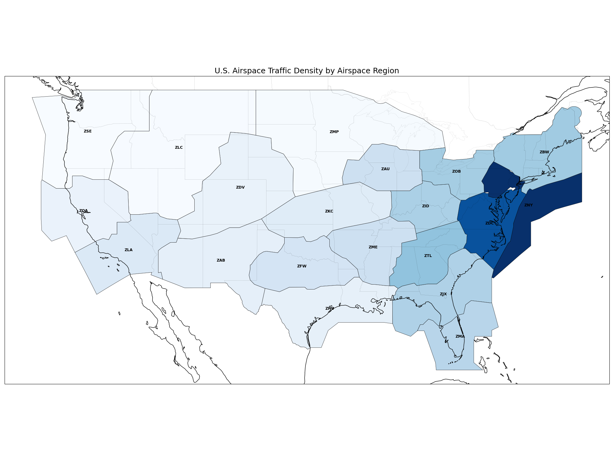
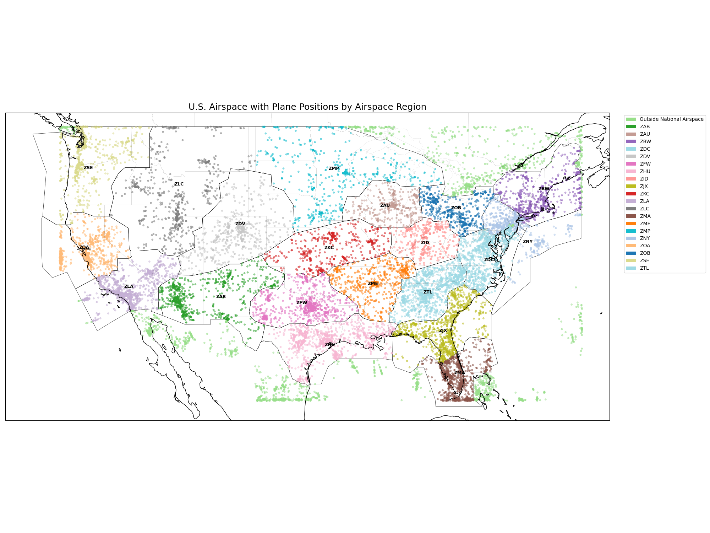

# Airspace Transition Analysis

## Team members
- Brian Hockett (mgh2xx)

## Data Source

**What data source did you work with?**

- OpenSky API (https://openskynetwork.github.io/opensky-api/rest.html#all-state-vectors)
  - Used the /states/all endpoint to poll real-time aircraft state vectors, including position, altitude, velocity, and metadata. This endpoint was queried repeatedly to build the flight dataset.

- ESRI ArcGIS Airspace Boundaries API
  - Queried once to retrieve static U.S. airspace boundary geometry and attributes in GeoJSON. Used for enrichment of flight dataset and expanded analysis.

## Challenges / Obstacles

**What challenges did this data choice present in data gathering, processing and analysis, and how did you work through them? What methods and tools did you use to work with this data?**

&emsp;This data choice presented a number of challenges, at all stages of ELT + Analysis. 

&emsp;At the gathering/extraction stage, understanding the query parameters and rate limits was a significant challenge. The 4,000 API credits per day limit and the fact that the credits per API call varied depending on the total area of the call forced me to make a choice between analyzing a small area at high frequency, or a large area at a lower frequency. I made the decision to analyze a larger area (the Continental U.S) at low frequency (1 call every 90 seconds), which allowed me to ensure I would never go over the rate limit. Similarly, API access tokens lasted only 30 minutes, so I had to include a step in my producer script to check if my token was valid, and request a new one if it was not. I used a Kafka producer to gather my data. The only Kafka-specific challenge was working with the responses of the API calls, which were unfamiliar to me. This required me to set up a number of print statements throughout my script to understand and resolve the issues I was having (which were mostly with the data types of the response). For example, flight identifiers were being converted to scientific notation, when they were meant to be string values, so I had to change the way the data was encoded before producing it to Kafka.

&emsp;Consuming/loading the data was much easier. For this step, I used Kafka to consume the data, which I then loaded into a DuckDB database. Because I had worked through the data type issues in the producer script, the only challenge that I was presented with at this step was dealing with the high volume and velocity of the data. My producer was generating ~4,000 state vectors per call, which put a heavy load on the consumer script and caused it to lag behind. I resolved this issue by loading the data into DuckDB in batches, rather than one row at a time. Inserting the data 2,000 entries at a time allowed it to keep up with the producer.

&emsp;Challenges in the transforming step were mostly self-inflicted. I used DuckDB to load in the OpenSky data, and the requests library to call the ArcGIS API to get the airspace boundaries data. Because of the scale of the data I decided to use the polars library, rather than pandas, to handle the OpenSky data. My unfamiliarity with polars made it very difficult for me to enrich the data and transform it the way I wanted to. I attempted to resolve this issue by using LLMs to convert my code from pandas to polars, but this solution did not always work, as the LLMs were also less familiar with polars. For example, none of the LLMs were able to help me convert from the Unix timestamp of the API response to a standard datetime format. Ultimately, I had to switch between my code, LLMs, and the polars documentation to finally get the transformation steps running correctly.

&emsp;The only challenges I faced in the analysis step were in working with geographic data. I had never visualized geographic data in python before, so I had to learn how to use the geopandas and cartopy libraries to make my visualizations and conduct my analysis.

## Analysis

**Offer a brief analysis of the data with your findings. Keep it to one brief, clear, and meaningful paragraph.**

&emsp;Due to the effect the government shutdown had on the efficiency of air travel, I decided to analyze the incoming and outgoing traffic of Air Route Traffic Control Centers (ARTCCs), which coordinate travel through en-route airspace in an attempt to identify where specific regions of the National Airspace System (NAS) would have been disproportionately affected and been in need of additional staffing or resource allocation to maintain safe and efficient traffic flow. Initially, I analyzed the total volume of aircrafts in specific ARTCC regions at a given time, and found the highest density of aircrafts in the Florida (ZMA, ZJX), Atlanta (ZTL), and DC (ZDC) regions. Because one of ARTCCs' major responsibilities is handing off aircrafts between regions, I decided to extend this analysis to be more dyanamic. First, I visualized the density of all aircraft positions over the course of the full timespan, which showed the most common flight paths taken. Then, I calculated the transfer rate (aircraft entrances + exits per hour) normalized by land area for each region. This yielded more interesting results, with the New York (ZNY) ARTCC having the highest normalized transfer rate of any region. Despite the higher density of aircrafts in other regions, the ZNY airspace had the highest transfer demand, likely due to their control of the majority of the airspace over the Atlantic Ocean, meaning they controlled incoming international travel, as well as travel into and out of New York City. Surprsingly, the Atlanta (ZTL) airspace did not stand out from others on the eastern half of the U.S, despite containing the busiest airport in the U.S, Hartsfield-Jackson Atlanta International Airport (ATL). Finally, I created a Streamlit application which visualizes the incoming and outgoing traffic for a selected ARTCC region, to give an idea of the actual per minute rate at which ARTCC controllers must transfer responsibility of aircrafts.

## Plot / Visualization

**Include at least one compelling plot or visualization of your work. Add images in your subdirectory and then display them using markdown in your README.md file.**

<table>
  <tr>
    <td></td>
  </tr>
  <tr>
    <td></td>
  </tr>
  <tr>
    <td></td>
  </tr>
  <tr>
    <td></td>
  </tr>
</table>

## GitHub Repository

https://github.com/brianhockett/Airspace-Transition-Analysis
