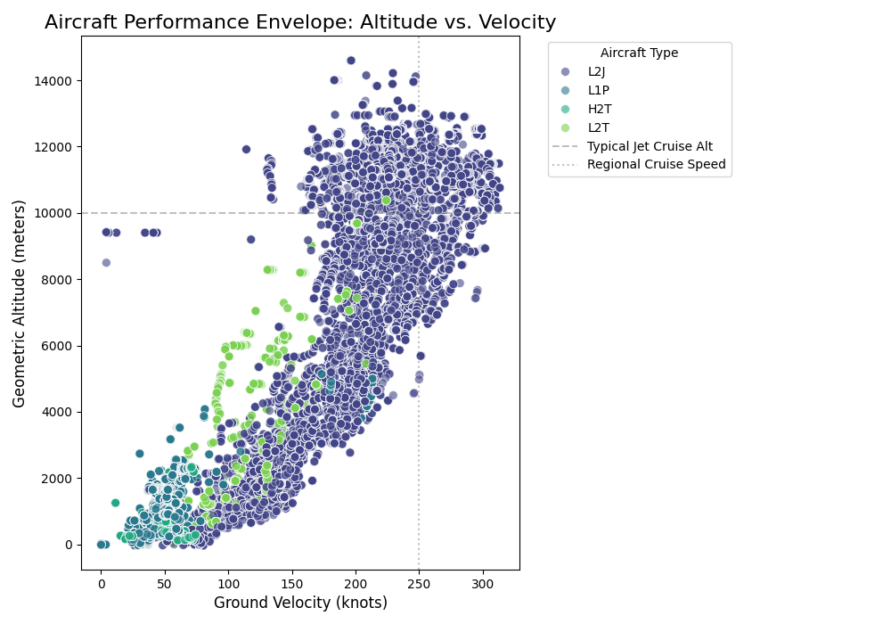
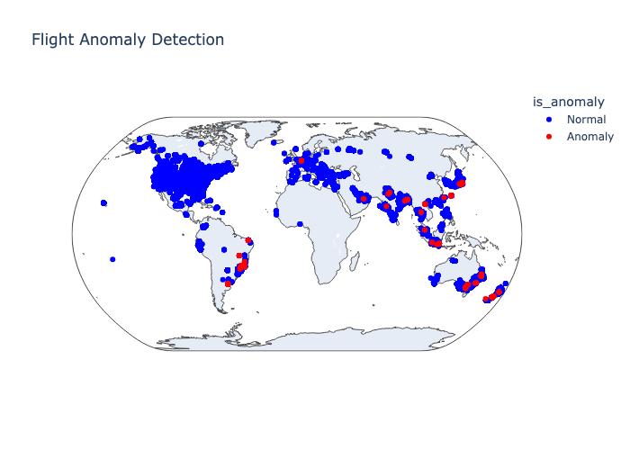

## Names:
Tyler Abele and Landon Burtle

## Data Source:
We utilize the **OpenSky Network API** to ingest live aircraft state vectors. This provides real-time telemetry including position (lat/lon), altitude (geometric and barometric), velocity, and aircraft identification (ICAO 24-bit address).

Additionally we use the Reference Data provided by the website to get information about both the airframes themseleves such as their model, operator, and aircraft type.

## Challenges:

1. **Streaming Data Volume & Windowing**: 
   - Handling the continuous influx of state vectors required a robust streaming architecture. We implemented **3-minute tumbling windows** to aggregate state changes and calculate deltas, rather than processing isolated points.
2. **Kafka Message Size Limits**: 
   - Aggregating thousands of flight states into single windowed messages exceeded standard 1MB Kafka limits. We had to reconfigure Redpanda and our producers to handle **large batch sizes (up to 100MB)** to ensure no data was dropped during high-traffic periods.
3. **Anomaly Definition**: 
   - Distinguishing between sensor noise and genuine anomalies is difficult. We moved from simple thresholding to **context-aware analysis**, comparing aircraft not just against global limits but against their specific aircraft type (peer comparison) and physical capabilities.

### Note:
We utilize a prefect workflow that, if given the right s3 persmission will run then entire pipeline automatically and produce new images with the updated data every 3 minutes. It is fully autonomous and will fun forever until stopped. However, if someone else is producing and consuming, anyone can run the workflow and still do the analysis and create the images.

## Analysis:

 Aircraft performance is heavily constrained by atmospheric physics: at higher altitudes, reduced air density requires higher true airspeeds to maintain lift, while at lower altitudes, drag increases and operational limits restrict maximum speed. When plotting geometric altitude against ground velocity, we observed a clearly defined performance envelope across aircraft categories (L1P, L2J, etc.). Quite note: for the category, the first letter is the type of aircraft (L for plane H for helicopter) and the second letter is the number of engines, and the last letter is the type of engine (P for piston, J for jet, etc.). As expected, jets cluster tightly around higher-altitude, higher-speed regimes, while turboprops and piston aircraft occupy lower, slower operational bands. This envelope served as a foundation for distinguishing statistically “normal” flight behavior from outliers.

To map where aircraft operate spatially, we produced a geospatial KDE heatmap, revealing global concentrations of active flights. Unsurprisingly, aircraft density is highest along established transcontinental corridors—North America, Europe, and East Asia—while anomalies tend to appear near highly trafficked hubs and transition points. This density model provided contextual grounding for interpreting outlier behavior geographically.

Building on these baselines, we implemented a multidimensional anomaly-detection system using an Isolation Forest. Rather than relying on simplistic thresholds, this model detects irregular patterns based on how quickly a sample can be isolated from the rest of the dataset. Because normal aircraft follow predictable spatial, kinematic, and vertical profiles, deviations in variables such as latitude, longitude, barometric altitude, velocity, and vertical rate often produce significantly shorter isolation paths, marking the flight as anomalous. This method is particularly effective for aviation telemetry because it naturally captures complex interactions—high climb rates at unusually low altitudes, lateral deviations inconsistent with standard airways, or velocity profiles that violate typical aircraft-category boundaries.

When applied to real flight windows, the model successfully identified a small but meaningful subset of flights flagged as anomalies. Some of these deviations correspond to benign causes—weather rerouting, holding patterns, or general-aviation variability—while others highlight operationally interesting behavior such as steep descents, abnormal climb rates, or flight paths deviating from established commercial routes. Visualizing these anomalies on a global map further illustrated their distribution: normal flights cluster densely along expected corridors, while anomalies appear intermittently across Europe, Southeast Asia, Oceania, and portions of South America.

## Github 

[Repo Link](https://github.com/Tyler-Abele/DS_3022_DP3)

## Plots

