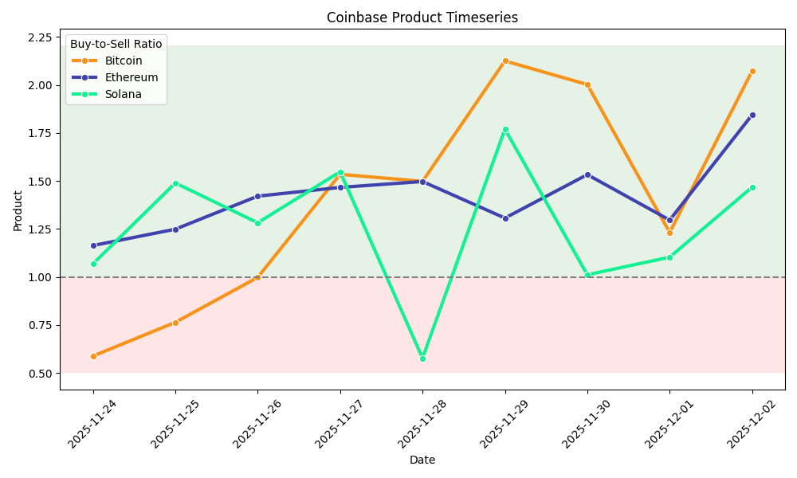
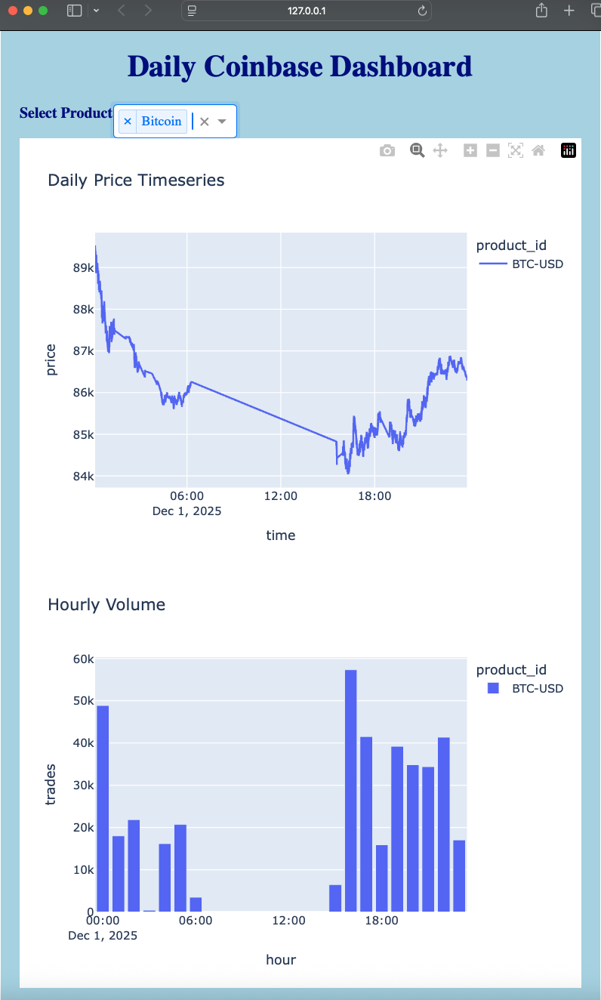

# Team MN

## Team members

Mason Nicoletti

## Data Source

I used the **Coinbase Market Data Websocket**. By subscribing to the live exchange feed, I was able to stream every transaction made on Coinbase for several cryptocurrencies that I specified as channels. I processed over 1.8M records incrementally over the course of a week.

## Challenges / Obstacles

A primary challenge was that I needed a continuous stream of data in order to produce the visualizations I wanted to make, such as timeseries charts of crypto prices. Unfortunately, I was not able to capture a continuous stream of data over the course of the day due to connectivity errors with the Coinbase websocket and streaming pauses when my laptop is closed. I made up for this by gathering data over the course of a week whenever I had the opportunity to be on my computer. As a result, the timeseries plots are not as detailed as they would be if the streaming was continuous. Additionally, the average values calculated for fields such as volume, price, open, low, high, etc. are not completely accurate due to gaps in the streaming. Regardless, it is possible to reproduce this streaming and data analysis to generate a fully continuous set of data in future work.

#### Tools

- **Coinbase Websocket** - streaming live Coinbase data
- **Apache Kafka** - producing and consuming data streams
- **DuckDB** - storing data incrementally
- **SQL** - creating various data tables and querying DuckDB
- **Matplotlib**, **Seaborn**, **Plotly** - producing plots and visualizations
- **Dash** - creating a Python dashboard

## Analysis

By streaming ticker data from Coinbase, I was able to monitor every transaction made to specified Coinbase products. I chose to subscribe to Bitcoin, Ethereum, and Solana, three popular cryptocurrencies. The stream returned useful fields such as price, time of the transaction, open, high, low, volume, best bid, best ask, side (whether the transaction was a buy or sell), and more. I wanted to analyze trends in the buying and selling of these products, so I created various plots that visualized the average volume of sales throughout a day, volume of sales throughout the week, and distribution of transactions among the three specified coins. I also engineered the buy-to-sell ratio variable of my own using the already existing side variable and performed analysis on this. I believe this variable can be a powerful indicator of when a coin is gaining or losing momentum, providing an indication whether it is a good time to buy or sell. I made timeseries plots of the price of each coin to track its performance live. Finally, I created a dashboard to serve as a daily summary of Coinbase product performances, as it has the ability to toggle between each of the coins and visualize their performance for a single day.

## Plot / Visualization

## GitHub Repository

https://github.com/masonnicoletti/coinbase-streaming
