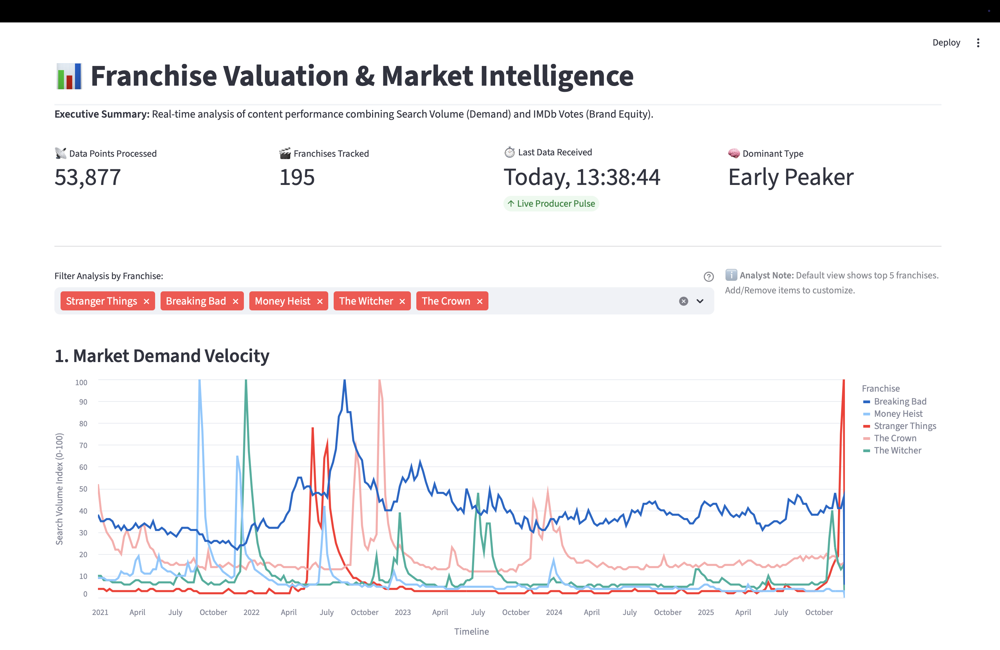
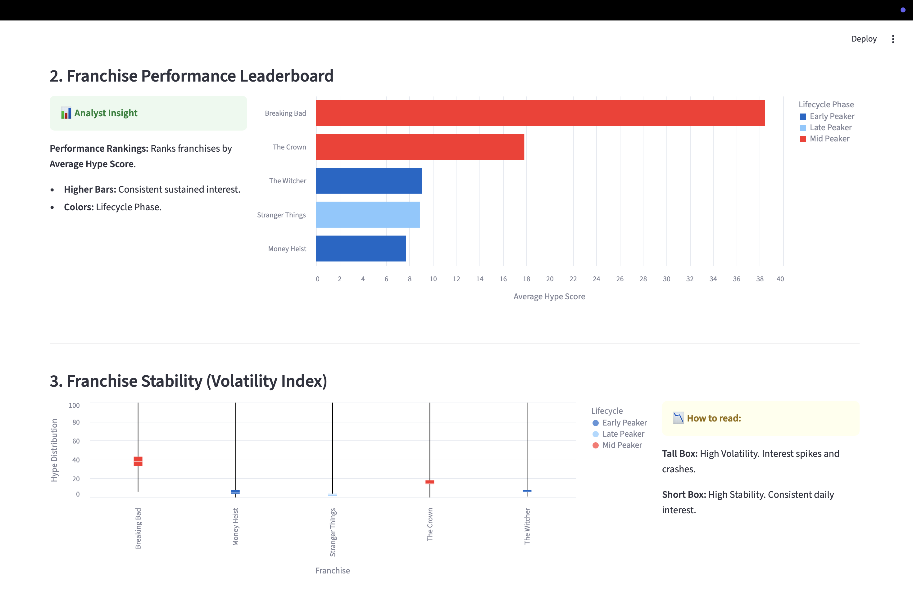

# Franchise Valuation Engine: Winning the Streaming Wars

### DS3022 Project 3

A real-time market intelligence dashboard that quantifies the value of entertainment franchises by combining **search demand velocity (Google Trends)** with **historical brand equity (IMDb)**.

---

## Team

Team name: Redis on the Shore

Team member: Dailin Li

## The Business Problem

In the modern “Streaming Wars,” content is king—but valuation remains opaque. Executives must decide:

- Which show to renew  
- Which IP to reboot  
- Which competitor to acquire  

Traditional indicators (e.g., Nielsen ratings) are outdated.  
This project introduces a modern valuation framework:

- **Hype (Velocity):** Real-time global attention  
- **Brand Equity (Mass):** Long-term fanbase strength  

---

## System Architecture

This project uses a microservices architecture built with Docker, designed to simulate a real-time analytics pipeline.

### Producer (`producer_integrated.py` & `producer_streaming.py`)
- **Phase 1:** Backfills five years of weekly Google Trends data  
- **Phase 2:** Streams new data every 4 hours  
- Implements **exponential backoff** to handle 429 rate limits  

### Message Broker (Redis)
- Serves as the system’s communication backbone  
- Uses a **FIFO queue** (`franchise_queue`) to decouple ingestion from processing  

### Consumer (`consumer.py`)
- Pulls messages from the queue  
- Enriches data with metadata  
- Stores “Gold” layer data in Redis for low-latency access  

### Dashboard (`app_enhanced.py`)
A Streamlit-based executive dashboard featuring:

- Real-time metrics  
- Lifecycle classification  
- Volatility analysis  
- Strategic franchise positioning  

---

## Data Strategy

Three datasets form a 360-degree franchise intelligence model:

| Source              | Role         | Metric Generated                                   |
|---------------------|--------------|----------------------------------------------------|
| Google Trends API   | The Pulse    | **Hype Score (0–100):** Standardized search demand |
| IMDb Datasets       | The Legacy   | **Brand Equity:** Total vote count                 |
| Netflix Titles      | The Seed     | Seed list of 200+ global franchises                |

---

## Key Algorithms & Insights

### Lifecycle Classification (“The Peaker Logic”)
Categorizes franchises as:



- **Early Peakers** – viral at launch, fade quickly  
- **Mid Peakers** – build momentum over seasons  
- **Late Peakers** – legacy IP experiencing resurgence  

### Volatility Index
Box-plot statistics identify:



- **High volatility:** Event-driven spikes  
- **Low volatility:** Steady “comfort TV” patterns  

### Strategic Matrix (Hype × Equity)
Reveals key asset categories:

- **Viral Hits:** High hype / low equity  
- **Legacy Staples:** Low hype / high equity  
- **Super Franchises:** High hype / high equity  

---

## Challenges & Obstacles

### Google Trends 429 Rate Limits
- **Problem:** Aggressive rate limiting  
- **Solution:** Circuit breaker with randomized cooldowns  

### Docker Networking
- **Problem:** Services unable to communicate  
- **Solution:** Custom Docker network with environment-based dynamic host selection  

### Real-Time Data Gaps
- **Problem:** Missing real-time data for niche shows  
- **Solution:** Switched to 4-hour high-frequency windows for better stability  

---

## How to Run

### Clone the Repository

```bash
git clone <repo_url>
cd streaming_challenge
```
