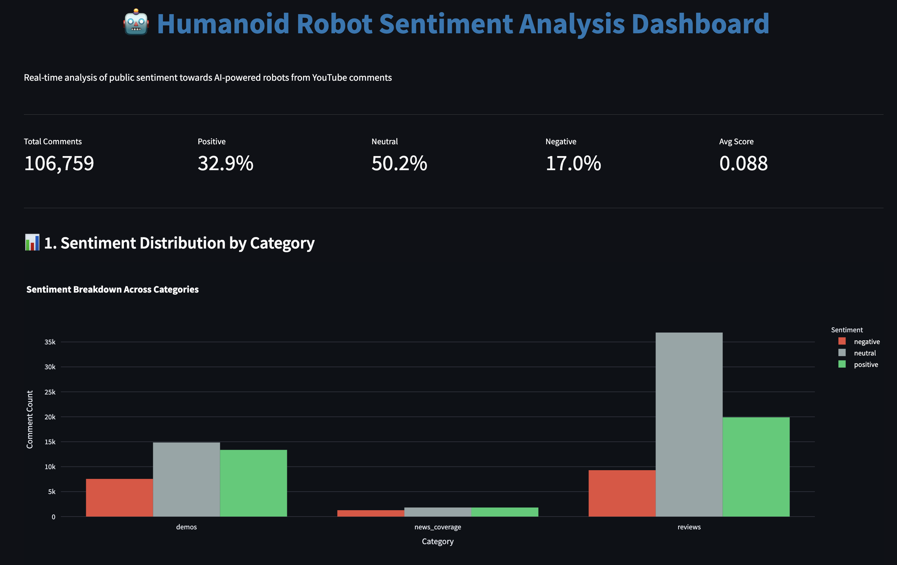
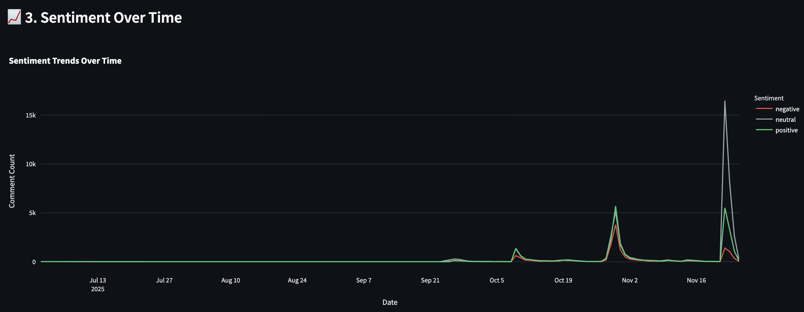
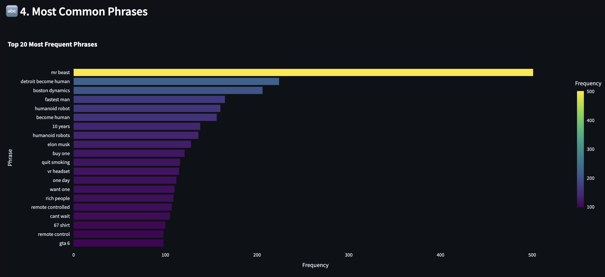
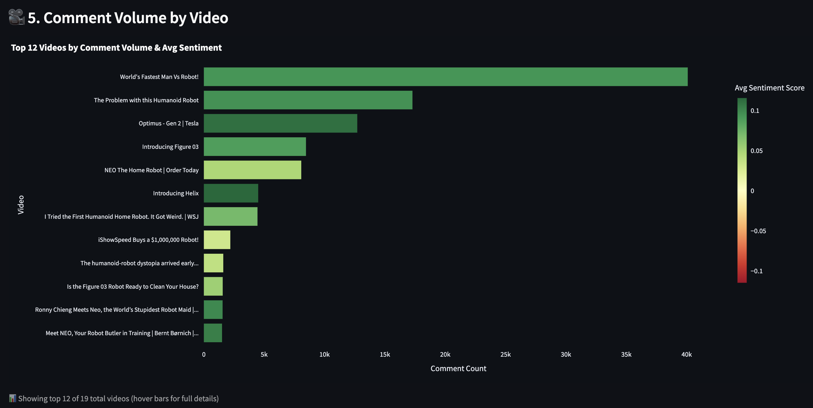
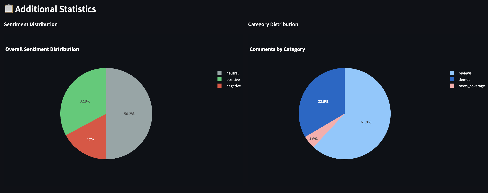

# Humanoid Robot Sentiment Analysis

## Team members

**Minu Choi** (qce2dp@virginia.edu) and **Patrick Ho** (bqu3tr@virginia.edu)

---

## Data Source

**YouTube Data API v3** - We collected **106,759 comments** from **19 videos** about humanoid robots, organized into three categories: product demos (Tesla Optimus, Figure AI), tech reviews (MKBHD, Marques Brownlee), and news coverage. The dataset spans July-November 2025, capturing public reactions during a critical product launch period for commercial humanoid robotics.

---

## Challenges / Obstacles

**YouTube API Rate Limits:** With a quota of 10,000 units/day, we implemented incremental fetching that only retrieves new comments on subsequent runs by comparing against existing comment IDs. We added pagination delays (0.2s) and early stopping logic (after 3 empty pages) to stay within limits.

**Streaming Architecture Complexity:** Managing Kafka infrastructure for real-time comment ingestion was challenging. We used **Docker Compose** for easy setup/teardown and implemented graceful degradation so the pipeline works even if Kafka is unavailable.

**Data Quality & NLP Noise:** Comments contained emojis, slang, and spam. We built a text cleaning pipeline with whitespace normalization (keeping punctuation like `!` because VADER uses it for sentiment intensity). For phrase extraction, RAKE initially generated generic terms like "looks like" and "feels like," so we created a custom filter list with 15+ filler patterns and minimum length requirements (5+ characters, 2+ words).

**Workflow Orchestration:** Coordinating the multi-step pipeline (fetch → process → analyze) required **Prefect** for workflow management with retries (2 attempts, 10s backoff), structured logging, and idempotent design (safe to re-run without duplicates).

**Tools Used:** Kafka (streaming), DuckDB (analytical database), Prefect (orchestration), Docker (containerization), NLTK VADER (sentiment analysis), RAKE (phrase extraction), and Streamlit (visualization - must be run manually with `streamlit run src/dashboard.py`).

---

## Analysis

Our analysis reveals **cautiously optimistic** public sentiment toward humanoid robots (32.9% positive, 50.2% neutral, 17.0% negative), but the most surprising finding is that **entertainment drives engagement far more than technical content**. The top-discussed phrase is "mr beast" (550 occurrences) from a viral YouTuber collaboration, not technical specifications. Product demos and independent reviews generate nearly identical positive sentiment (~0.09), while news coverage is more neutral (0.06), suggesting visual proof matters more than journalistic framing. Reviews drive 2x more engagement than demos (66K vs 36K comments), and the high neutrality (50%) indicates we're in the "early awareness" phase of technology adoption where curiosity outweighs conviction. Notably, the most common phrases are pop culture references ("detroit become human" video game, "mr beast" challenges) rather than technical discussions, revealing that the public frames robots through entertainment narratives rather than engineering capabilities. This suggests companies seeking public acceptance should prioritize influencer partnerships and embrace pop culture comparisons rather than focusing solely on technical specifications.

---

## Plot / Visualization

### Sentiment Distribution by Category
Reviews and demos show nearly identical positive sentiment, while news coverage remains more neutral.



### Sentiment Over Time (July-November 2025)
Clear spikes align with major product announcements (Figure 03, Tesla Optimus updates) and viral content (MrBeast collaboration).



### Top Phrases by Sentiment
Pop culture dominates: "mr beast" and "detroit become human" (video game) are among the most discussed terms, not technical specifications.


### Most Common Phrases
Entertainment and sci-fi references dominate over technical discussions.



### Comment Volume by Video (Top 12)
MrBeast's "World's Fastest Man Vs Robot!" generated 40K+ comments, far exceeding most technical demos. Color indicates average sentiment (green = positive).



### Additional Statistics
50% neutral sentiment indicates "wait-and-see" mentality. Reviews dominate comment volume (62% of total).



---

## GitHub Repository

https://github.com/minuuva/Humanoid-Sentiment-Analysis

**Note:** The interactive dashboard can be launched manually by running:
```bash
streamlit run src/dashboard.py
```

**Key Technical Highlights:**
- **106,759 comments** processed across 19 videos
- **4 modern data engineering tools**: Kafka, DuckDB, Prefect, Docker
- **Streaming + Batch architecture**: Lambda pattern for real-time and historical data
- **Idempotent pipeline**: Safe to re-run, only processes new data