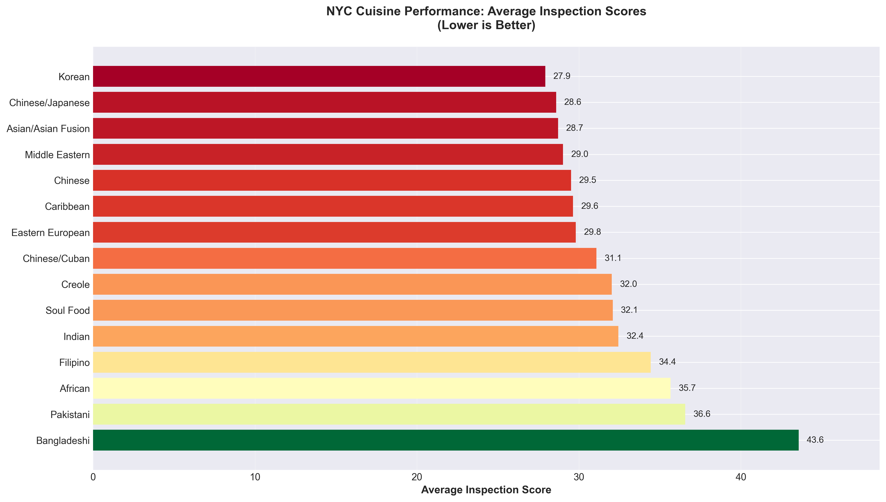
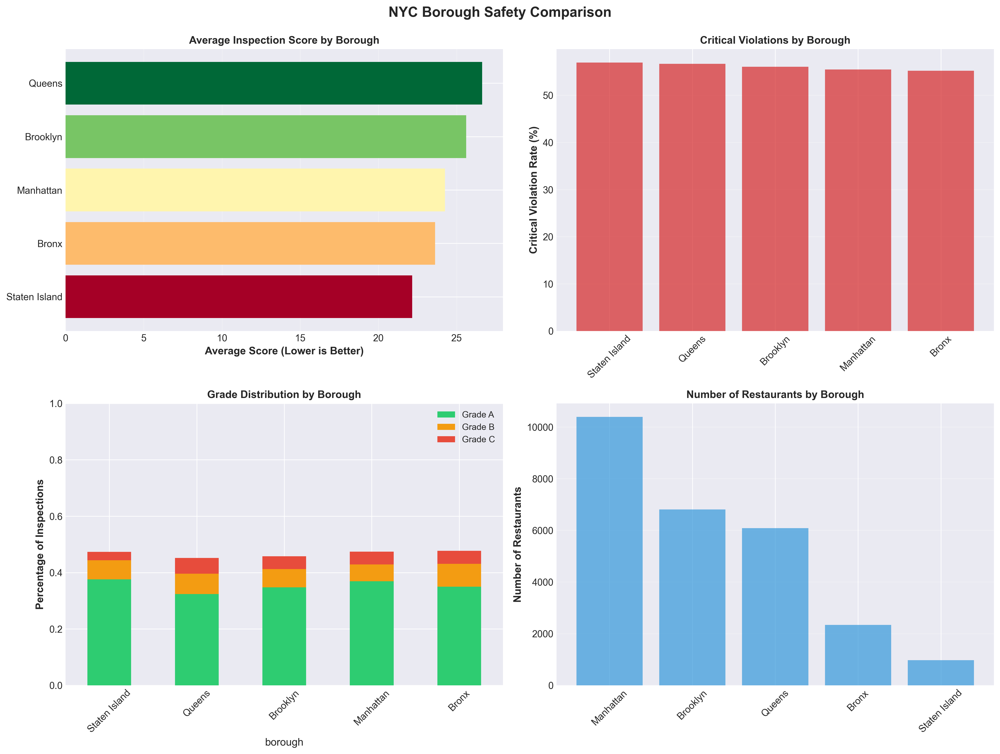
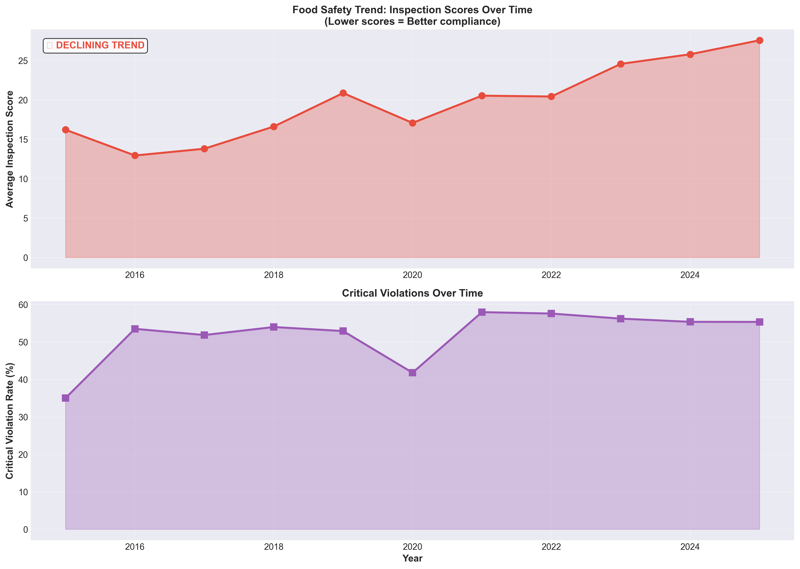
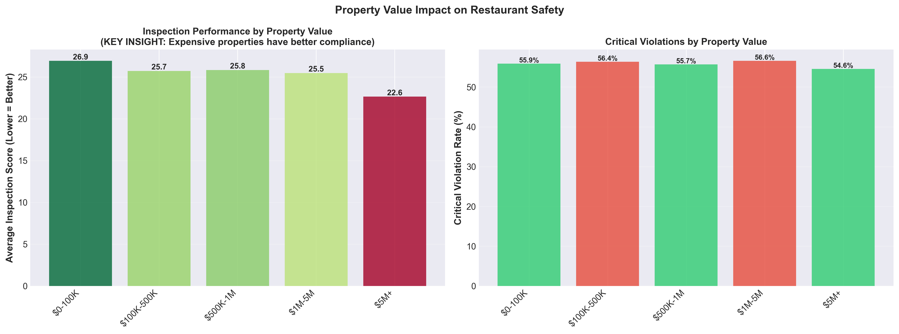
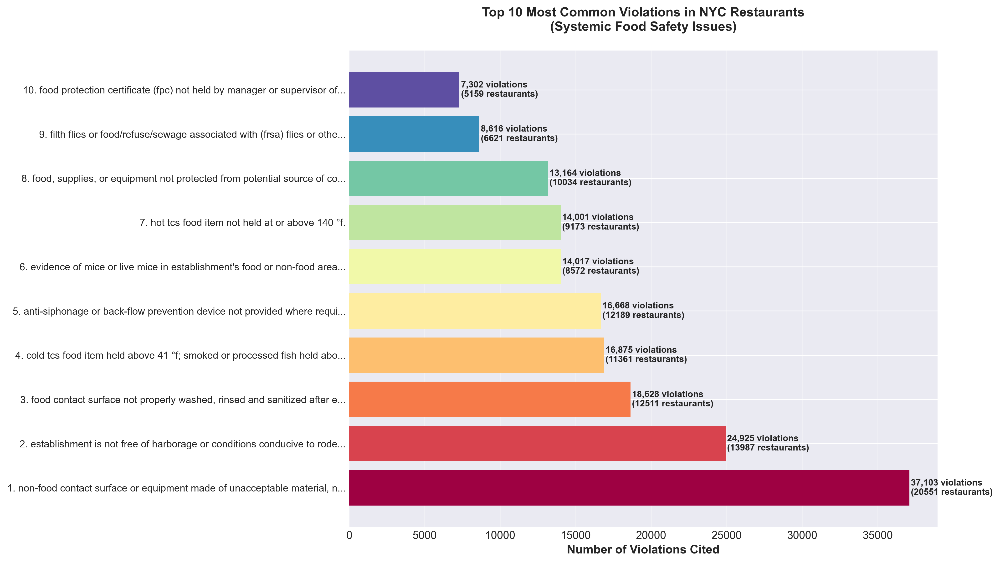

# NYC Restaurant Inspections & PLUTO Streaming and Data Analysis

This project builds a high-velocity streaming pipeline that ingests ~1M+ records from two NYC Open Data APIs: NYC Restaurant Inspection Results and NYC Primary Land Use Tax Lot Output (PLUTO). It uses producer/consumer architecture to ingest data, incrementally writing the incoming raw data to DuckDB, enabling the two datasets to be joined based on Borough-Block-Lot. This allowed for efficient columnar analysis of how restaurant grades intersect with building economics, revealing that lower-value properties and certain cuisines drive higher risk. Citywide trends show worsening inspection scores without improvement in critical violations, and violation-frequency analysis highlights tens of thousands of recurring pest and sanitation issues, indicating systemic gaps in basic facility maintenance across the city.

## Team Members

- Jessica Ni  
- Jolie Ng  

## Data Source

For this project, we worked with two publicly available NYC Open Data datasets accessed through the NYC Open Data Socrata API. The first is the NYC Restaurant Inspection Results dataset, which provides detailed inspection records for restaurants across the city, including inspection dates, numeric scores, violation descriptions, grades, and critical/non‑critical flags. The second is the NYC Primary Land Use Tax Lot Output (PLUTO) dataset, which describes the physical and economic characteristics of each property, such as assessed value, year built, retail area, and BBL identifiers that let us tie buildings to individual restaurant inspections.

## Challenges & Obstacles / Tools

NYC Open Data provides a REST API, but our first challenge was figuring out how to use the data in a streaming workflow. We didn’t want to read in the data using a single API call, so to add some challenge into data loading, we simulated streaming by creating a Kafka producer to read the dataset in chunks and publish each record individually into a Kafka topic, effectively turning the batch API into a continuous data stream. Tools used for data gathering and ingesting were Kafka producer/consumer and redpanda through Docker, DuckDB for storage, python for data cleaning and analysis.

For cleaning and analysis, the main obstacles we faced were messy identifiers, inconsistent text, and having some duplicate records. We had to normalize BBLs to join inspections to PLUTO, standardize cuisine and violation strings, drop the obviously bad scores, and collapse multiple inspections for the same restaurant and date into a single record before any of the aggregates made sense. Then, we used DuckDB SQL and pandas to build an analysis-ready table with derived features (year/month, score buckets, property value bands, and building age at inspection), and then used matplotlib and seaborn to turn those summaries into the borough, time-series, property-value, cuisine, and violation visualizations that we have included in a separate subdirectory.

## Analysis

Overall, the inspection property data shows that restaurant safety in NYC is uneven and, in many ways, moving in the wrong direction. Borough‑level summaries and plots highlight that Queens and Brooklyn have some of the highest average inspection scores, while Staten Island has the lowest average score but one of the highest critical violation rates, suggesting that “better” scores don’t always mean safer kitchens. Temporal trend plots show average inspection scores creeping upward over the last decade and critical violation rates staying stubbornly high, indicating no strong citywide improvement in compliance. When restaurants are grouped by PLUTO-assessed property value, those in the lowest value band (\$0–100K) have the worst scores, while \$5M+ properties perform noticeably better, implying that higher-value buildings can invest more in food safety infrastructure. Cuisine-level analysis shows us that some cuisines (e.g. Bangladeshi, Pakistani, and several African cuisines) have higher average scores and higher critical violation rates, while cuisines like Japanese, Mediterranean, and Vegan cluster at the safer end with more A grades. And lastly, the violation-frequency table and bar chart show us that basic facility and pest issues (dirty non-food-contact surfaces, evidence of rodents or flies, and poor sanitation practices) happen tens of thousands of times across the city, which points to systemic weaknesses in everyday maintenance.

## Plot / Visualization

Below are some of our key visualizations from our analysis:

- Average inspection scores by cuisine type for the riskiest cuisines in our sample:  
  

- Borough safety comparison (average scores, critical violation rates, grade mix, and restaurant counts):  
  

- Citywide temporal trends in inspection scores and critical violation rates over time:  
  

- Property value impact on average inspection score and critical violation rate:  
  

- Top 10 most common violations across NYC restaurants:  
  

## Github Repository

https://github.com/hzheni/DS3022-DP3
