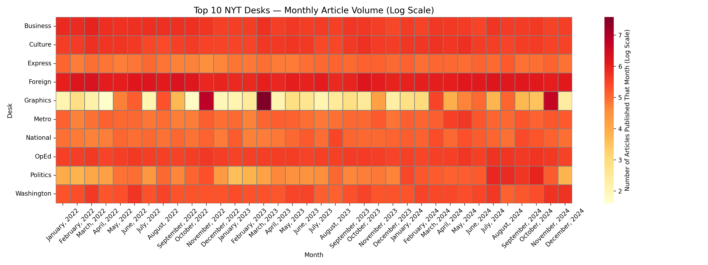
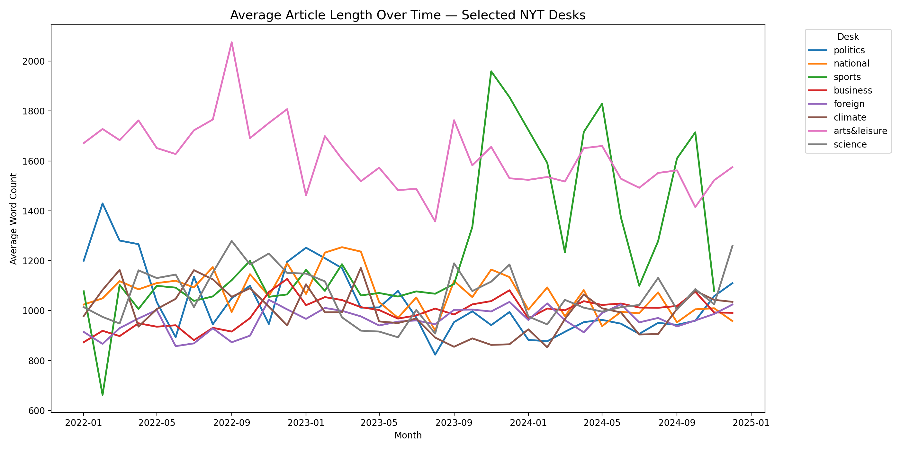

# Team Hill/Garozzo

## Team members

Dylan Hill and Ben Garozzo

## Data Source

What data source did you work with?

The data source that we worked with for data project 3 was the NYT Archive API. This API returns metadata for entire months of New York Times articles at a time, dating all the way back to 1851. We found that there are around 3,000 to 4,000 articles returned for every month, meaning there are around 36,000 to 48,000 articles (or rows of data) published every year. Thus we decided that 3 years of data (or 36 months) would be a sufficient amount of data to gather and work with for this project. We set 2022-2024 as the years that we wanted to gather data for but these can easily be changed to broaden or narrow the scope.

## Challenges / Obstacles

What challenges did this data choice present in data gathering, processing and analysis, and how did you work through them? What methods and tools did you use to work with this data?

This project presented several challenges across data acquisition, ingestion, storage, and analysis that required both technical and architectural decisions to resolve effectively. One of the first challenges was choosing the appropriate New York Times API. We initially debated between the Newswire API and the Article Search API - the Newswire API provides near-real-time access to metadata about newly published articles, whereas the Article Search API allows keyword-based retrieval with pagination. However, both APIs imposed limitations that made them inefficient for collecting data at the scale this project required. Ultimately, we selected the NYT Archive API because it returns full monthly archives of all articles and allowed us to retrieve tens of thousands of records efficiently with significantly fewer API requests. This choice was critical in making large-scale historical analysis feasible within the project timeline. Once we selected the Archive API, a major challenge was designing an ingestion strategy that respected API constraints. Through documentation review and testing, we discovered that the archive endpoint enforces a strict limit of five requests per minute. To work within this constraint, we implemented explicit rate limiting in our workflow by inserting scheduled pauses between calls. This ensured compliance with usage limits, prevented request failures, and allowed the ingestion process to run unattended over long periods without being blocked or throttled.

Another significant challenge was maintaining visibility into pipeline progress. Because data was ingested month-by-month across multiple years, we needed a way to track which periods had been successfully retrieved and which had failed. To solve this, we implemented a manifest-based checkpointing system using structured metadata stored alongside the dataset. This allowed the system to persist ingestion state across runs, skip already processed months, retry failed months, and resume from where it left off after interruptions—making the pipeline resilient and restartable. We also needed to decide where to store the data during ingestion. While local file storage was initially considered, it quickly became apparent that this approach would not scale well for large volumes of raw JSON data. Instead, we opted to use Amazon S3 as a cloud-based data lake. Each month of data was uploaded to a structured directory layout in S3, allowing us to persist raw data safely, simplify versioning, and decouple ingestion from analysis. Storing data in S3 also enabled parallel access from multiple environments and ensured we could reprocess or reload data at any time without re-querying the API.

Finally, after ingestion, a major challenge was working directly with semi-structured JSON data at scale. To address this, we converted the raw JSON files into Parquet format for efficiency and query performance. We then used DuckDB as our analytics engine, connecting directly to the S3 bucket and querying the Parquet files without needing to download the data locally. This setup enabled fast exploratory analysis and SQL-based transformations across a large dataset stored remotely. Throughout the project, we relied on Prefect to orchestrate all ingestion tasks, manage retries and failures, apply rate limiting, enforce validation rules, and update pipeline state through the manifest system. DuckDB served as our primary analytical engine for querying and transforming the data, while Amazon S3 functioned as our persistent backend storage layer. Together, these tools allowed us to build a scalable, fault-tolerant ingestion system and perform efficient analysis on a large historical collection of news data.

## Analysis

Offer a brief analysis of the data with your findings. Keep it to one brief, clear, and meaningful paragraph.

This project combined textual analysis with temporal trends to examine how coverage priorities and storytelling depth have evolved across major New York Times desks. The word-frequency analysis and word clouds were used as a high-level exploratory tool to identify the topics that dominate each desk’s headlines, revealing clear thematic separation (e.g., politics vs. business vs. culture) and confirming that each desk has a consistent editorial focus over time. The heatmap of the ten most prolific desks reveals a more meaningful shift in newsroom behavior: while Business, Culture, and Foreign coverage remain remarkably stable month-to-month, Politics and Washington show pronounced volatility, with sharp spikes around major news cycles—most notably between April and October 2022 and again more recently—suggesting responsiveness to elections, geopolitical instability, and national crises rather than steady reporting flow. Finally, the average word-count trends highlight differences in how deeply desks invest in storytelling; Arts & Leisure consistently produced the longest articles, reinforcing its role as a long-form desk, while Politics shows a gradual decline in average length from 2022 to 2024, possibly reflecting a shift toward faster news cycles and breaking coverage. Sports stands out with a significant spike in article length at the end of 2023, likely driven by postseason coverage and major athletic events, while Climate articles remain surprisingly stable in length, suggesting that the desk’s depth of reporting has not changed substantially despite heightened attention to environmental issues. Together, these results show that while topic focus remains consistent, the intensity and format of coverage reflect broader shifts in public interest, newsroom strategy, and the evolving pace of journalism.

## Plot / Visualization

Include at least one compelling plot or visualization of your work. Add images in your subdirectory and then display them using markdown in your README.md file.

## GitHub Repository

https://github.com/dylanhill7/Data-Project-3/tree/main
