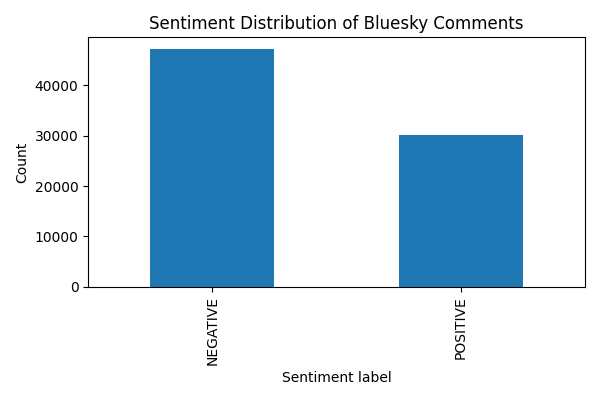
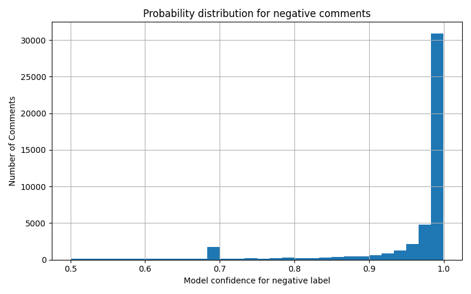

# Team Skyblue

## Team members

Dongju Han

## Data Source

I have worked with the bluesky jetstream firehose API, a public real-time websocket
stream providing all global bluesky post events. The stream delievers JSON messages representing posts, metadata, and user information.

## Challenges / Obstacles

Our pipeline collects around 100k Bluesky posts in real time and perform some transformations to only contain comments that are in English. 
The architecture:
Bluesky Firehose -> Kafka -> ETL Consumer -> Cleaned JSONL -> Sentiment Analysis -> Visualizations

Challenges include large message ingestion, but I handled the challenge by using Kafka as a durable buffer before ETL.
Methods and tools include quixstreams for kafka ingestion, huggingface 'transformations' for sentiment analysis, pandas for ETL, and matplotlib for visualizations.

## Analysis

From 100k posts, we analyzed a total of 77,350 English posts.
More than half of the comments are considered to be negative.
Negative contents tends to be short, direct, and reactive (breaking news, politics, arguments, sports events).
Most negative comments fall between 0.5 - 1.0 probability
A  cluster of highly negative comments exists, which usually includes insults or hate speech.
Findings suggest that Bluesky has more comments that have a negative tone than positive tone overall, and the comments that are classified negative are usually highly negative.

## Plot / Visualization

Negative vs Positive Comments:

Negative Probability Histogram:

## GitHub Repository

https://github.com/djhan0330/ds3022-data-project-3
