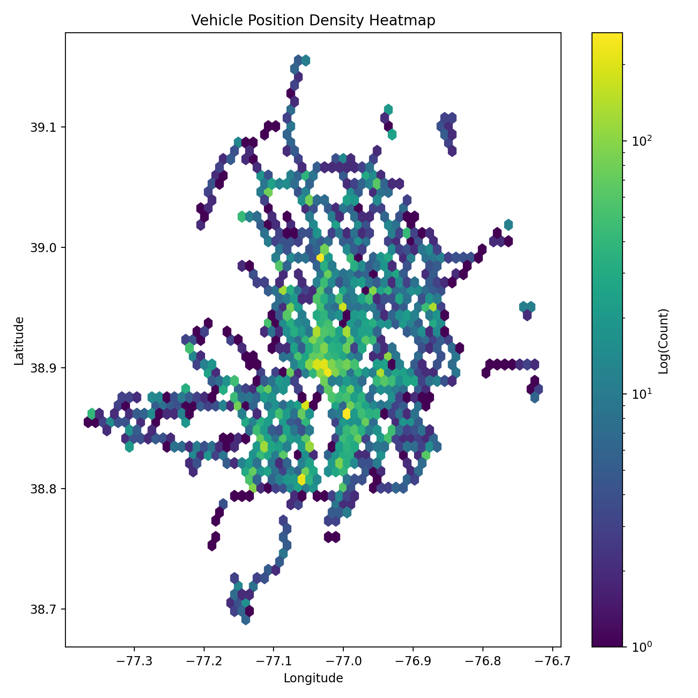
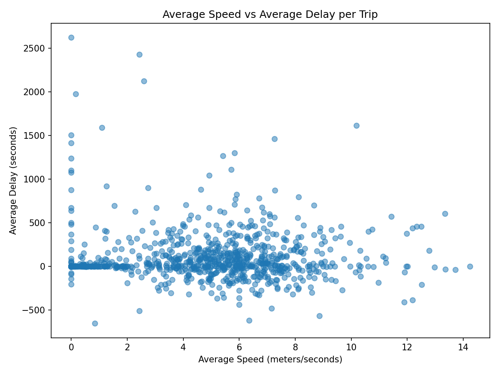
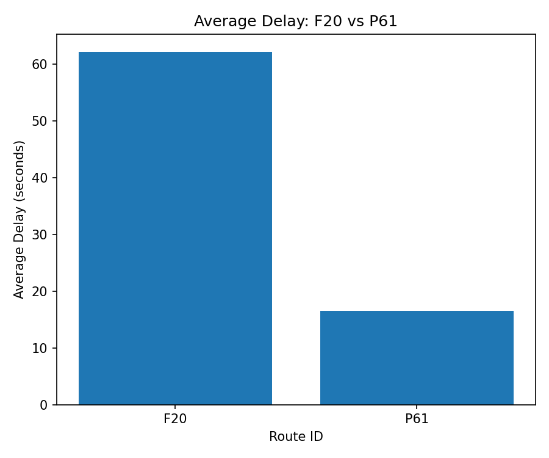

# Team Metro

## Team members
Ryan Ermovick & Dev Aswani

## Data Source

What data source did you work with?

The data sources we worked with were multiple API's from the Washington Metropolitan Area Transit Authority (WMATA). The first API we pulled information from was the Bus Update API, which gave information on delays, status, etc.. The second API that we pulled information from was the Bus Position API, which gave position information (latitude and longitude), speed, and more. To access this data source, an account is needed (free). 

To collect a sufficient amount of data, the producer was ran for 24 iterations which generated over 60,000 records. The APIs can be found here: https://developer.wmata.com/ 

## Challenges / Obstacles

What challenges did this data choice present in data gathering, processing and analysis, and how did you work through them? What methods and tools did you use to work with this data?

A challenge that we encountered in processing this data was the format. Since the APIs were giving information about vehicles, the data was presented in General Transit Feed Specification (GTFS). This required an additional parsing step to make it easily accessible. Another challenge/consideration was the time of collecting and processing data into Kafka. Both APIs dump out records for every bus in use at the time of the API call. If the API was called continously, then not much new information would be gathered about each bus (it is very unlikely that the information about a bus will change in less than 1 second). To address, we made a loop that would wait 45 seconds before collecting data again. Additionally, the amount of time for data collection can be varied. A limitation with the analysis of this data comes in the form of timing. To collect a days worth of bus information from the WMATA API's the producer script must be ran for an entire day. This can become impractical fast. This limits the analysis as only a small subset of data is reasonably available. This also presents a limitation with the dataset, in the fact that it is only realtime, not stored data from a csv. Another limitation was the fact that consuming the data to a duckdb file took a very long amount of time. This limited to the amount of data that could be reasonably processed as well. 

To work with this data, we used Kafka to collect streams of data from both API endpoints. This was chosen as data is continously coming in from metro API's, so the capabilty to collect it all is needed. But, as mentioned above, we don't need all of that data. So we used Prefect to create flows for our processess and to ensure retries in case an error occured (such as a time format error). Additionally, Prefect was used in portions of this project as it handles logging in a simple/easy manner. We used specific packages to parse the GTFS format of the data. After producing and consuming the streaming data, we placed inside of a Duckdb Database that could be accessed with SQL commands. Our project showcases the usage of many Data Engineering tools (Kafka, Duckdb, and Prefect).

## Analysis

Our analysis revealed several meaningful dynamics in WMATA’s bus operations. By aggregating thousands of position records, we observed that only a small subset of routes such as A58, C63, and F60 dominated the live feed, suggesting that specific corridors generate disproportionately higher operational activity. A spatial density heatmap showed that WMATA bus traffic concentrates heavily along a few high-volume urban corridors, forming distinct geographic hot zones of movement rather than evenly distributed coverage. This visualization also provides a unique way of visualizing bus routes and the geogrpahic area that WMATA encompasses. Using the delay feeds, we also compared average delays across routes and found clear differences: some routes consistently experienced higher delays than others, which indicates that certain lines may be more sensitive to congestion, scheduling pressure, or operational bottlenecks. One very interesting suprising finding was that some bus routes also experience negative delays. A negative delay occurs when a bus is moving faster than predicted and arrives early. This is interesting as it shows some routes might have less congestion or traffic, and can provide useful insight to those planning trips, such as deciding to come early or late to a bus stop. This visualization is useful because it allows people to determine which bus route is ideal for them based on timing. Combining streaming positions with delay updates shows that real-time bus data is far from uniform, and meaningful patterns only emerge after processing reasonably large volumes of streaming records. These patterns reveal where the WMATA network experiences the greatest stress and variability.

## Visualizations

### Heatmap of Bus Locations
This visualization is a heatmap that shows the locations of busses based on their latitude and longitude. The heatmap provides not only a unique visualization of bus routes and sites of congestion, but also a visual representation of Washington D.C. and it's neighboring suburbs. 

### Speed vs. Delay Plot
This visualization is a scatterplot of the speed of a vehicle versus it's delay. The plot provides information on how the speed of a vehicle can effect it's delay in seconds. 

### Average Delay between two Routes 
This visualization takes in user input to compare the average delay for two different bus routes. Users can then compare routes to see which has a worse or better delay. 

## GitHub Repository

https://github.com/RyanErm/DP3/tree/main

