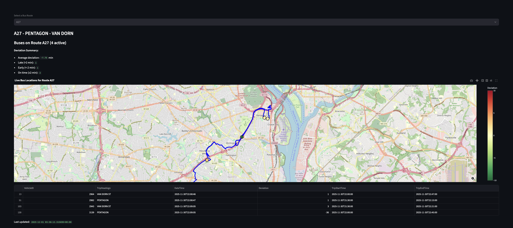
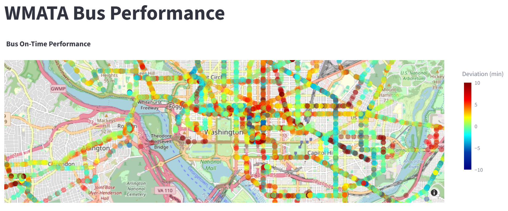

# Team bus

## Team Nyla Upal and Liam Ward

## Data Source

What data source did you work with?     
[API Docs](https://developer.wmata.com/docs/services/5476363f031f590f3809255b/operations/5476363f031f590d34cfc4f8)
We chose to work with bus route and stop data from the Washington Metropolitan Area Transit Authority API. It provides live bus locations, deviations, and trip metadata for the DC metro area. We chose this as it had continuously updating data on the buses, and it gave their longitude and latitude so they would be able to be displayed on a map.     

## Challenges / Obstacles

The tools used were Redpanda as a streaming platform for ingesting bus data. Docker Compose for container orchestration for reproducihbility and easy setup. Redis for in-memory data storage. DuckDB as a database for storing and querying bus positions. Streamlit and Plotly to create the interactive dashboard for real-time visualization and analysis.  

In order to get the continuous data from the bus position api, we used Apache Kafka to have a producer that got the positions of all the buses every 30 seconds. We then also had a consumer that read from the created bus positions topic and then wrote the bus information to a duckdb file. From this, the app file creates a dashboard using streamlit that has the live positions of the buses. Initially just using the bus position only gave the disconnected positions of the buses, so we had to use the path details api to get the entire routes and display those on the map as well. We also had issues getting the streamlit platform to refresh and update, which is why we had to use the streamlit autorefresh package to have it refresh every 30 seconds as the producer pulled updated positions.    
Since the API also gave deviation, which was the deviation from the scheduled time, so how late or early the bus was, we decided to also look into which areas the buses tended to be more late in. To do this we created another file (bus-timeliness.py) that would create a dashboard over all of the given data and plot all of the buses, colored by their deviation. To do this we ran the producer and consumer for half an hour to get a sufficient amount of data for analysis, and then ran the file.    

## Analysis

The dashboard provides live locations of the buses, but also summarizes average, late, early, and on-time bus deviations per route. Looking at each specific route reveals which routes experience the most delays or early arrivals. The insights from this can inform transit planners and riders about the service reliability.   
From the map of deviation we can see that there aren't neccessarily specific areas that always have more late buses. There are some specific routes that had negative deviation scores consistently and not many positive ones, and some areas that were very deep red, but mostly the routes seemed to vary on timeliness so it must be based on the individual buses. There are some areas that are deep red but not many that are deep blue, showing that the deviations may be overall skewed and buses tend to run behind and not ahead of schedule. 

## Plot / Visualization
     

*Live map of bus positions and deviation summary for a selected route.*

*Map of all routes' deviation performance*

## GitHub Repository

https://github.com/liamward26/Transit-Dash
