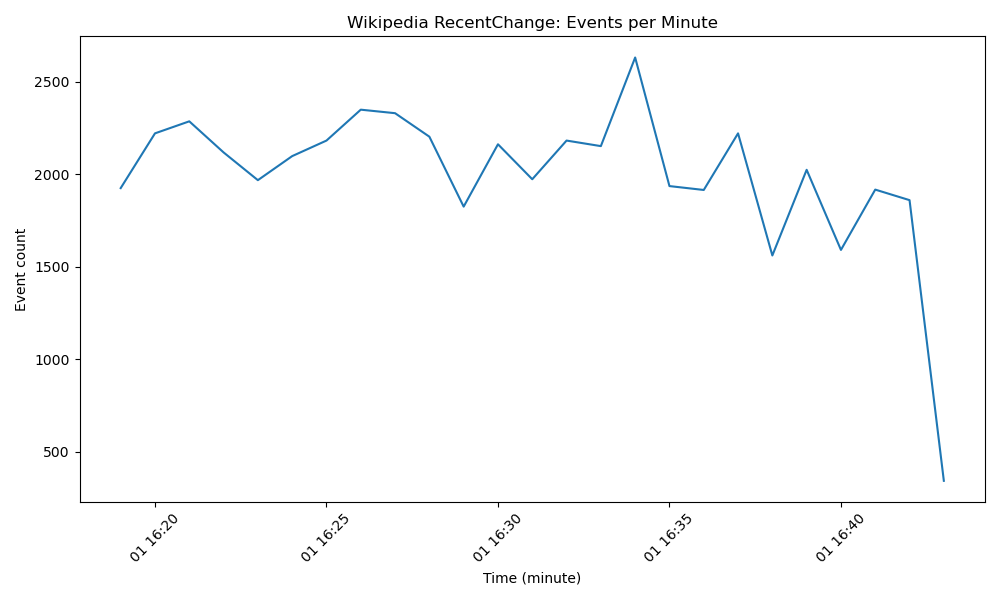
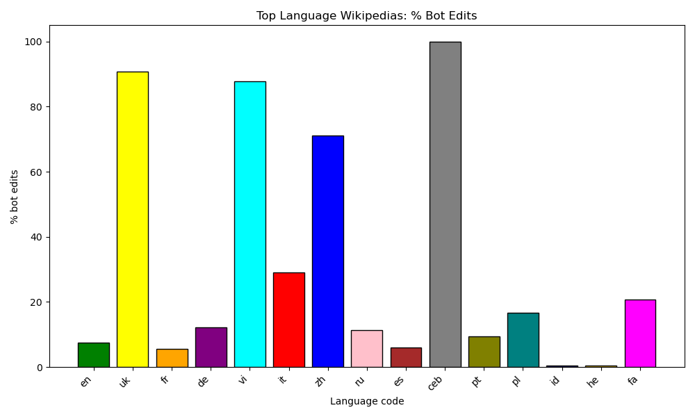
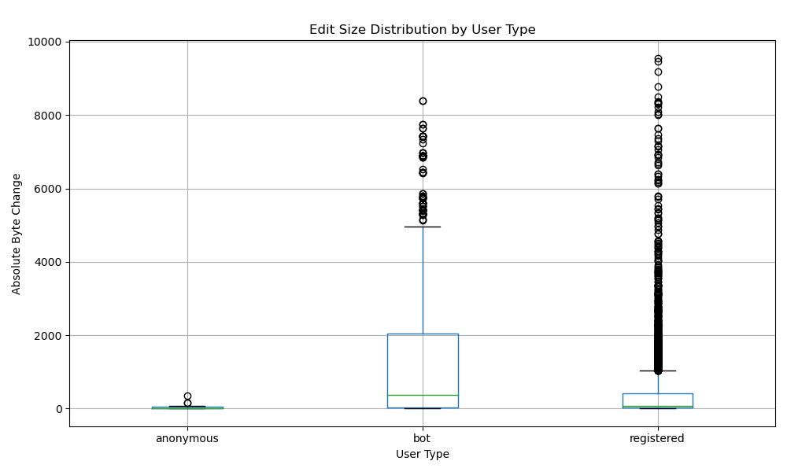
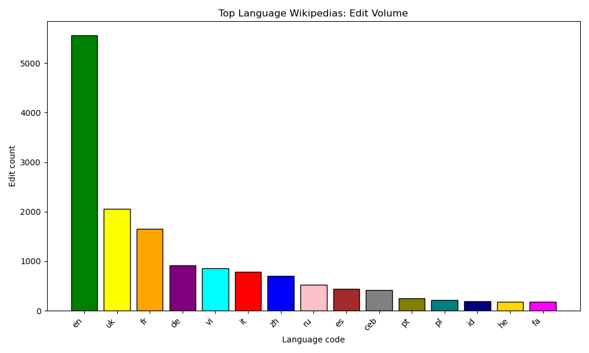
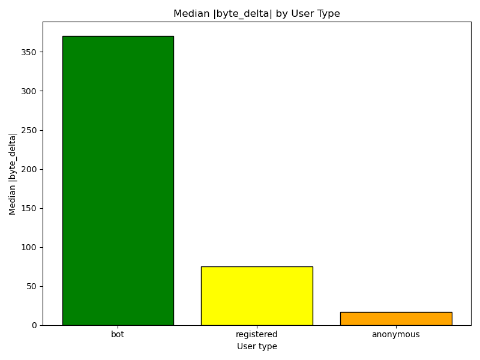
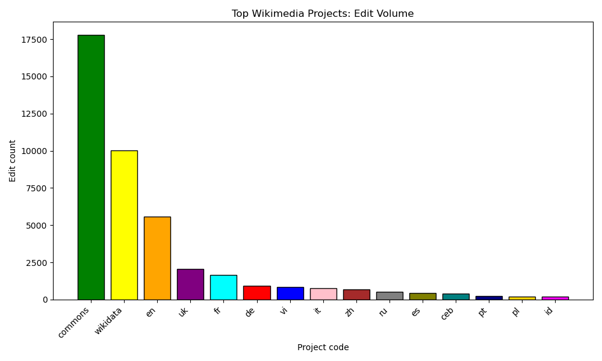

# Team wiki_stream_pipe

## Team members
Leah Kim

## Data Source

**What data source did you work with?**
The data source that I worked with is the Wikipedia Event Stream. I used this API with the endpoint of https://stream.wikimedia.org/v2/stream/recentchange used in class. It contains the live stream of all edits, page creations, and deletions happening to all Wikimedia projects. 

## Challenges / Obstacles

**What challenges did this data choice present in data gathering, processing and analysis, and how did you work through them? What methods and tools did you use to work with this data?**

The challenges that this data presented was first that it has a high volume real-time stream. The stream is continuous and so I implemented extraction that would be chunked with a time limit of 10 minutes per each chunk, as well as an event limit, in order to avoid memory issues. In addition, I wrote to the database every 500 events instead of every one in order to make collecting the data more efficient. 

The second challenge that I faced was that the data came in a complex nested JSON structure. Because it came in a JSON structure, I needed to manually extract each of the fields like the type, wiki, title, user, etc, and build a new row in my DuckDB. In order to do this, I parsed each event into a python dictionary first and pulled out the fields I needed, including the nested values, and inserted them into DuckDB.

The third challenge that I ran into was that the timestamps for the events came in 2 different formats, like in unix and ISO string, so I needed to standardize them all to the TIMESTAMP type using DuckDB’s TRY_CAST(). 

During the analysis part, one problem that I ran into was that I wanted to compare the different Wikipedia projects as well as languages, but I needed to find a way to only extract the languages for the language only analysis. To do this, I researched a way by using substr() to extract the project codes, for example, extracting “en” from “enwiki” to create a separate analysis for the language-only part. 

The last challenge that I ran into was that I wanted to have a way to be able to compute the bot vs human behavior patterns. Because editing activity can include extreme outliers, using the mean wouldn’t be as accurate of a description. I thought the best way to do this was to find the median as the primary statistic and compute it directly in SQL using DuckDB MEDIAN(). 

Some trade-offs and limitations of my approach include that only 50,000 events were collected for this run, which is a small sample size compared to the total volume of edits happening on Wikipedia. In addition, because the data is real-time and constantly changing, the results of my analysis may vary with each run of the program. However, I found that many of the trends and patterns stayed consistent across different runs.

## Analysis

**Offer a brief analysis of the data with your findings. Keep it to one brief, clear, and meaningful paragraph.**
Based on the 50,000 Wikipedia events that I have collected for this run, the activity stayed roughly consistent, with a sharp dip at the end likely due to an incomplete final minute of collection rather than a real drop in edits. When analyzing whether more edits came from an article edit or not, it appeared as though the stream was dominated by maintenance work rather than article edits. Only 34.68% of events were in the main/article namespace of 0, while 65.32% were in non-article spaces. This was surprising to see as I initially expected most of the edits to be on articles. The most common event types were editing and “categorize” with the top Wikimedia projects being from Wikimedia Commons and Wikidata, with English Wikipedia being the third top. When analyzing just the top language wikipedias, English was at the top with Ukrainian and French trailing behind. However, it was interesting to see that only 7.8% of English Wikipedia were bot edits for this round, while for Ukrainian it was 90.8% and 5.49% for French. It was also interesting to see that Cebuano had a 100% that were “bot” edits. Looking at the median edit size rather than mean in order to reduce the impact of extreme outliers, I found that bots tended to make typical larger edits (median byte_delta = 372), whereas registered users had a median of around 75. Finally, all of the hot topic articles, meaning lots of edits from lots of different editors within a 10 min window, came from the Category section, which are pages that are used for maintenance/cleanup. This suggests that many spikes are driven by automated cleanup workflows rather than breaking-news edits. Of course, with every run of the program and my prefect workflow, the 50k messages collected are going to be different every run. This can change up the results, however, I found that most of the results displayed above stayed pretty similar throughout different runs. It is interesting to see the results change yet stay pretty consistent. 

## Plot / Visualization

**Include at least one compelling plot or visualization of your work. Add images in your subdirectory and then display them using markdown in your README.md file.**

### Events per Minute

### Top Language Wikipedias: % Bot Edits

### Edit Size Distribution by User Type

### Language Edit Volume

### Median Edit Volume by User Type

### Wikimedia Project Edit Volume

## GitHub Repository

https://github.com/leahhkim/wikipedia-stream-ds3022
